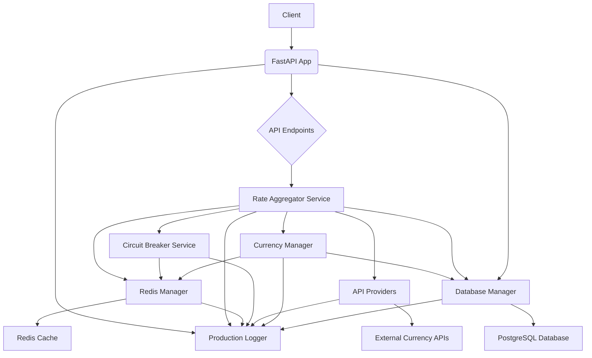
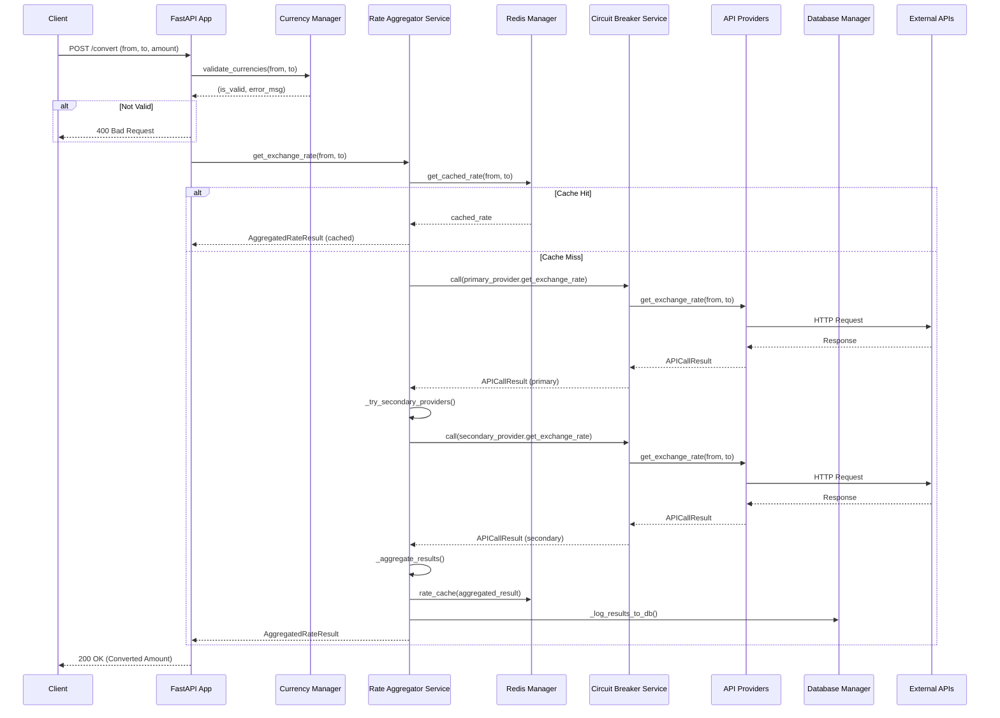

# Currency Converter API

## Project Overview

The Currency Converter API is a robust and scalable microservice designed to provide real-time currency exchange rates and conversion functionalities. It aggregates data from multiple external API providers, implements resilience patterns like Circuit Breakers, and utilizes caching to ensure high availability and performance.

## Features

*   **Real-time Currency Conversion:** Convert amounts between various currencies using up-to-date exchange rates.
*   **Multiple API Provider Integration:** Aggregates rates from several external currency exchange rate providers (e.g., Fixer.io, OpenExchangeRates, CurrencyAPI).
*   **Circuit Breaker Pattern:** Enhances fault tolerance by preventing cascading failures when external providers become unavailable.
*   **Redis Caching:** Improves performance and reduces external API calls by caching exchange rates and supported currencies.
*   **Database Persistence:** Stores supported currencies and API call logs for historical analysis and system monitoring.
*   **Comprehensive Health Checks:** Provides detailed health status of all internal and external components.
*   **Structured Logging:** Centralized, structured JSON logging for better observability and debugging.
*   **FastAPI Framework:** Built with FastAPI for high performance and easy API development.

## Architecture

The Currency Converter API follows a microservice architecture, composed of several key components:

1.  **FastAPI Application:** The core web application exposing RESTful API endpoints.
2.  **Rate Aggregator Service:** Orchestrates calls to external currency providers, applies aggregation logic, and interacts with caching and circuit breaker mechanisms.
3.  **API Providers:** Adapters for different external currency exchange rate APIs (Fixer.io, OpenExchangeRates, CurrencyAPI).
4.  **Circuit Breaker Service:** Manages the state of external API integrations to prevent system overload during failures.
5.  **Redis Manager:** Handles all interactions with the Redis cache for storing rates, supported currencies, and circuit breaker states.
6.  **Database Manager:** Manages connections and operations with the PostgreSQL database for persistent storage of supported currencies and logs.
7.  **Currency Manager:** Handles validation and population of supported currencies.
8.  **Monitoring & Logging:** Centralized structured logging for all application events.



## Data Flow

### Currency Conversion Request (`/convert`)

1.  **Client Request:** A client sends a `POST /api/v1/convert` request with `from_currency`, `to_currency`, and `amount`.
2.  **FastAPI Endpoint:** The request is received by the `convert_currency` endpoint.
3.  **Currency Validation:** The `CurrencyManager` validates the requested currencies.
4.  **Cache Check:** The `RateAggregatorService` first checks the Redis cache for a fresh exchange rate.
5.  **Primary Provider Call:** If no fresh rate is found, the `RateAggregatorService` attempts to fetch the rate from the primary external API provider via its `CircuitBreaker`.
6.  **Secondary Provider Calls:** If the primary provider fails or for comparison, calls to secondary providers are made (potentially in parallel).
7.  **Rate Aggregation:** The `RateAggregatorService` aggregates results from successful providers, applying logic (e.g., using primary, falling back to secondary, averaging).
8.  **Cache Update:** The aggregated rate is stored in Redis.
9.  **Database Logging:** API call details and exchange rates are logged to the PostgreSQL database.
10. **Response:** The converted amount and rate details are returned to the client.



## Technologies Used

*   **Python 3.10+**
*   **FastAPI:** Web framework for building APIs.
*   **Uvicorn:** ASGI server for FastAPI.
*   **SQLAlchemy:** ORM for database interactions.
*   **PostgreSQL:** Primary database for persistent data.
*   **Redis:** In-memory data store for caching and circuit breaker state.
*   **Httpx:** Asynchronous HTTP client.
*   **Alembic:** Database migrations.
*   **Pydantic:** Data validation and settings management.
*   **Docker:** Containerization.

## Setup and Installation

### Prerequisites

*   Docker and Docker Compose (recommended for local development)
*   Python 3.10+ and `pip` (for manual setup)

### Using Docker Compose (Recommended)

1.  **Clone the repository:**
    ```bash
    git clone https://github.com/your-repo/currency_converter.git
    cd currency_converter
    ```
2.  **Create `.env` file:** Copy `.env.example` to `.env` and fill in the required environment variables (e.g., API keys for currency providers, database URL, Redis URL).
    ```bash
    cp .env.example .env
    # Edit .env with your actual API keys and database/redis connection strings
    ```
3.  **Build and run services:**
    ```bash
    docker-compose up --build
    ```
    This will start the FastAPI application, PostgreSQL, and Redis.

4.  **Access the API:**
    The API will be available at `http://localhost:8000`.
    *   Interactive API documentation (Swagger UI): `http://localhost:8000/docs`
    *   Alternative API documentation (ReDoc): `http://localhost:8000/redoc`

### Manual Setup (Python Virtual Environment)

1.  **Clone the repository:**
    ```bash
    git clone https://github.com/your-repo/currency_converter.git
    cd currency_converter
    ```
2.  **Create and activate a virtual environment:**
    ```bash
    python -m venv .venv
    source .venv/bin/activate
    ```
3.  **Install dependencies:**
    ```bash
    pip install -r requirements.txt # (You might need to generate this from pyproject.toml)
    ```
    *Note: If `requirements.txt` is not present, you can generate it from `pyproject.toml` using `poetry export -f requirements.txt --output requirements.txt --without-hashes` if Poetry is used, or `pip install poetry && poetry install` to install dependencies directly.*

4.  **Set up environment variables:** Create a `.env` file based on `.env.example` in the project root and populate it with your API keys and database/Redis connection strings.

5.  **Run database migrations:**
    ```bash
    alembic upgrade head
    ```
6.  **Start the FastAPI application:**
    ```bash
    uvicorn app.api.main:app --host 0.0.0.0 --port 8000 --reload
    ```
    The `--reload` flag is useful for development.

## Configuration

The application is configured using environment variables. A `.env.example` file is provided as a template.

| Variable                  | Description                                                              | Default Value          |
| :------------------------ | :----------------------------------------------------------------------- | :--------------------- |
| `DATABASE_URL`            | PostgreSQL connection string                                             | `database_url`         |
| `REDIS_URL`               | Redis connection string                                                  | `redis://localhost:6379` |
| `FIXERIO_API_KEY`         | API key for Fixer.io                                                     | `demo_key`             |
| `OPENEXCHANGE_APP_ID`     | App ID for OpenExchangeRates                                             | `your_app_id`          |
| `CURRENCYAPI_KEY`         | API key for CurrencyAPI                                                  | `your_api_key`         |
| `PRIMARY_PROVIDER`        | Name of the primary currency provider (e.g., `FixerIO`)                  | `FixerIO`              |
| `CB_FAILURE_THRESHOLD`    | Circuit Breaker: Number of failures before opening                       | `5`                    |
| `CB_RECOVERY_TIMEOUT`     | Circuit Breaker: Time in seconds before attempting half-open             | `60`                   |
| `CB_SUCCESS_THRESHOLD`    | Circuit Breaker: Number of successes in half-open before closing         | `2`                    |
| `ENVIRONMENT`             | Application environment (`development`, `production`)                    | `production`           |
| `HOST`                    | Host for the FastAPI application                                         | `0.0.0.0`              |
| `PORT`                    | Port for the FastAPI application                                         | `8000`                 |

## API Endpoints

All API endpoints are prefixed with `/api/v1`.

### 1. Convert Currency

*   **Endpoint:** `POST /api/v1/convert`
*   **Description:** Converts an amount from a source currency to a target currency.
*   **Request Body (`ConvertRequest`):**
    ```json
    {
        "from_currency": "USD",
        "to_currency": "EUR",
        "amount": 100.00
    }
    ```
*   **Response Body (`ConvertResponse`):**
    ```json
    {
        "from_currency": "USD",
        "to_currency": "EUR",
        "amount": 100.00,
        "converted_amount": 85.50,
        "exchange_rate": 0.8550,
        "confidence_level": "high",
        "timestamp": "2025-09-27T10:30:00Z"
    }
    ```
*   **Alternative (GET):** `GET /api/v1/convert/{from_currency}/{to_currency}/{amount}`
    *   Example: `/api/v1/convert/USD/EUR/100`

### 2. Get Exchange Rate

*   **Endpoint:** `POST /api/v1/rates`
*   **Description:** Retrieves the current exchange rate between two currencies.
*   **Request Body (`ExchangeRateRequest`):**
    ```json
    {
        "from_currency": "USD",
        "to_currency": "EUR"
    }
    ```
*   **Response Body (`ExchangeRateResponse`):**
    ```json
    {
        "from_currency": "USD", 
        "to_currency": "EUR",
        "exchange_rate": 0.8550,
        "confidence_level": "high",
        "timestamp": "2025-09-27T10:30:00Z"
    }
    ```
*   **Alternative (GET):** `GET /api/v1/rates/{from_currency}/{to_currency}`
    *   Example: `/api/v1/rates/USD/EUR`

### 3. Health Check

*   **Endpoint:** `GET /api/v1/health`
*   **Description:** Provides a comprehensive health status of all system components (database, cache, providers, circuit breakers).
*   **Response Body (`HealthResponse`):**
    ```json
    {
        "status": "healthy",
        "timestamp": "2025-09-27T10:30:00Z",
        "services": {
            "database": {"status": "healthy", "response_time_ms": 12},
            "cache": {"status": "healthy", "response_time_ms": 5},
            "rate_aggregator": {
                "service": "rate_aggregator",
                "providers": {
                    "FixerIO": {"state": "CLOSED", "status": "healthy", "failure_count": 0},
                    "OpenExchange": {"state": "CLOSED", "status": "healthy", "failure_count": 0}
                }
            }
        }
    }
    ```
*   **Simple Health Check:** `GET /api/v1/health/simple`
*   **Provider-specific Health Check:** `GET /api/v1/health/providers`

## Logging

The application uses a centralized, structured JSON logging system. Logs are categorized by event type and stored in separate files within the `logs/` directory at the project root.

*   **`logs/system/app.log`**: General application events.
*   **`logs/errors/errors.log`**: Warnings, errors, and critical messages.
*   **`logs/api/api_calls.log`**: Detailed logs of all external API interactions.

## Circuit Breaker

The Circuit Breaker pattern is implemented to enhance the resilience of external API calls. Each external API provider has its own circuit breaker.

*   **States:** CLOSED, OPEN, HALF_OPEN.
*   **Configuration:** Configurable via environment variables (`CB_FAILURE_THRESHOLD`, `CB_RECOVERY_TIMEOUT`, `CB_SUCCESS_THRESHOLD`).
*   **Logging:** State transitions and failures are logged as `CIRCUIT_BREAKER` events.

## Caching

Redis is used for caching to reduce latency and load on external APIs.

*   **Exchange Rates:** Cached with a 5-minute TTL.
*   **Supported Currencies:** Cached for faster validation.
*   **Circuit Breaker State:** Redis stores the current state and failure counts for each circuit breaker.

## Database

A PostgreSQL database is used for:

*   **Supported Currencies:** Stores a list of all supported currency codes.
*   **API Call Logs:** Records historical data of all external API calls, including success/failure status, response times, and error messages.
*   **Circuit Breaker Logs:** Persists circuit breaker state changes for auditing and analysis.

## Testing

To run tests, ensure you have the development dependencies installed (e.g., using `pip install -r requirements-dev.txt` or `poetry install --with dev`).

```bash
pytest
```

## Contributing

(Optional section for contribution guidelines)

## License

(Optional section for license information)
